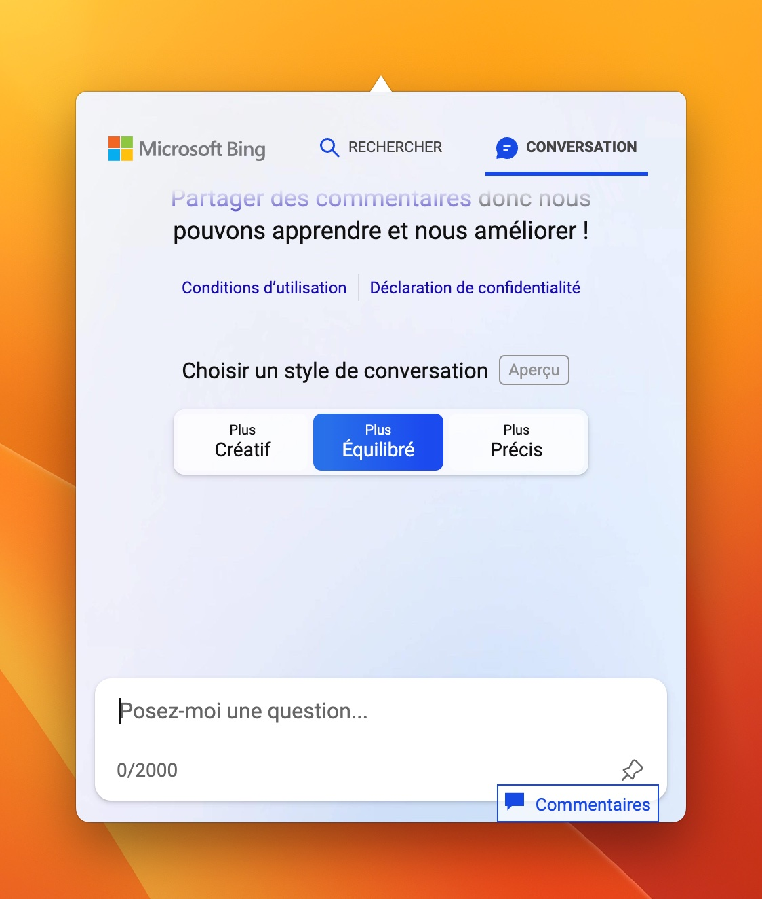

# BingAI for desktop

This is a simple app that makes BingAI live in your menubar.

You can use Cmd+Shift+G (Mac) or Ctrl+Shift+G (Win) to quickly open it from anywhere.

  

## Credit

All credit and copyrights goes to Bing.

## Author

Louis Gallet
You can find the original author on Twitter [@vincelwt](https://twitter.com/vincelwt).
